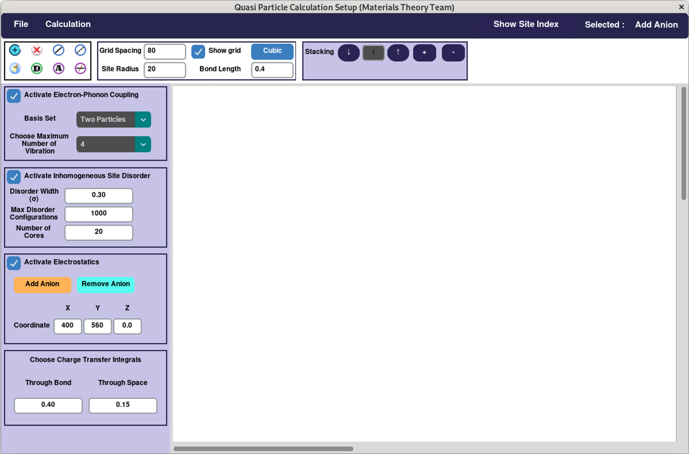
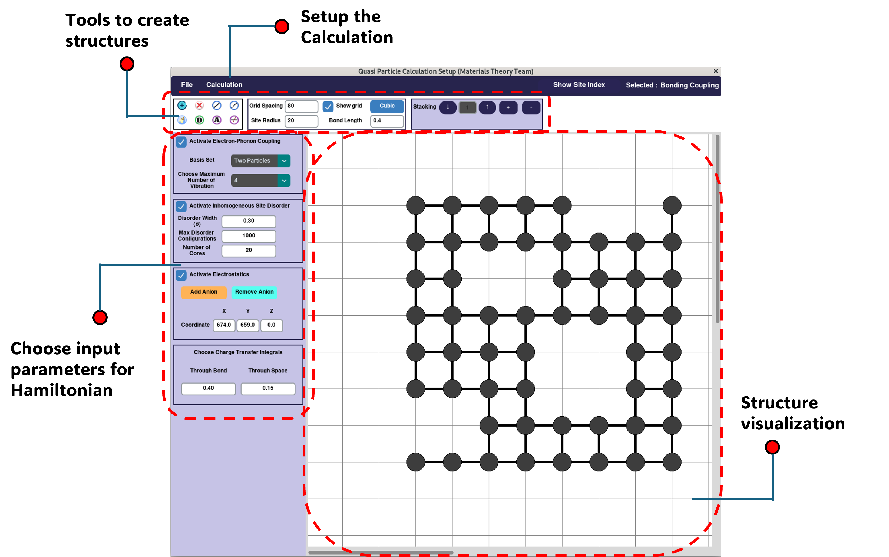

# QSPEC-D

This is a GUI-based software to create an input file compatible with the QSPEC-D running software. This is a very primitive version of the software and is still under development.

To use this Python-based GUI software, you need to install Python on your system and create a new Python environment.  
To create a Python environment, follow these steps:

```sh
python -m venv myenv
```

Then, activate the environment using the following steps:

### For Windows  
```sh
.\myenv\Scripts\activate
```  
### For Linux  
```sh
source myenv/bin/activate
```

After activating your environment, install the required Python libraries using pip:

```sh
pip install numpy matplotlib scipy tqdm customtkinter
```

After finishing the installation, run the `mt2.py` file:

```sh
python mt2.py
```

This will open the GUI software. The interface of the GUI will look like this:



Now, you can interact with the GUI software to create input files for further calculations.



---

# RunQSPEC-D

To run the calculation, place the input file inside the `RunQSPEC-D` folder. Open the `main.py` file and update the filename to match your input file name. Then, run the file while the environment is active:

```sh
python main.py > out.log
```

Wait for some time to get the results. You will receive the `out.log` file, which contains all the details of the calculation, and a `.dat` file with absorption spectra data as your result.

