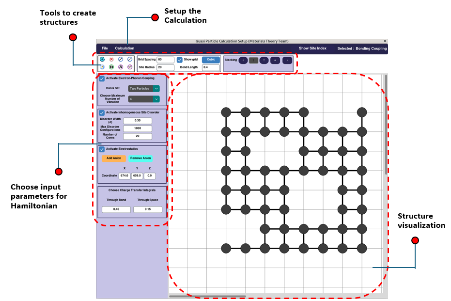

# QSPEC-D


Lead Developer: Amiya Paul <br>
Contact: apaul7@ncsu.edu <br>
Department of Chemistry <br>
Materials Theory Team, North Carolina State University

## Overview
QSPEC-D is a software package that simulates the infrared spectrum of polarons in disordered 1D and 2D pi-conjugated systems such as semiconducting polymers and covalent organic frameworks. The algorithm  is based on Holstein Hamiltonian that is diagonalized using the  multiparticle basis set. QSPEC-D is a very primitive version still under  development and is not intended for public release or cloning at this time. 

## Theory 

More details about the modeling can be found in these references. Feel free to contact Raja at rghosh8@ncsu.edu to know more about the theory and modeling.

1. Excitons and Polarons in Organic Materials, Ghosh, R. and Spano, F.  Acc. Chem. Res. 2020, 53, 10, 201–2211. <br><br>
2. Polaron Delocalization in Conjugated Polymer Films, Ghosh, R.; Pochas, C. M.; Spano, F. C. J. Phys. Chem. C 2016, 120, 11394−11406. <br><br>
3. Spectral Signatures and Spatial Coherence of Bound and Unbound  Polarons in P3HT Films: Theory vs Experiment, Ghosh, R.; Chew, A.R.;  Onorato, J.; Pakhnyuk, V.; Luscombe, C. K.; Salleo, A.; Spano, F.C., ", J.  Phys. Chem. C 2018, 122 (18048) <br><br>
4. Anisotropic Polaron Delocalization in Conjugated Homopolymers and  Donor–Acceptor Copolymers, Ghosh, R.; Luscombe, C. K.; Hambsch, M.; Mansfeld, S.C.B; Salleo, A.; Spano, F.C., ", J. Phys. Chem. C 2018, 122 (18048) <br><br>
5. Connecting the Dots for Fundamental Understanding of Structure– Photophysics–Property Relationships of COFs, MOFs, and Perovskites using a Multiparticle Holstein Formalism, Ghosh, R. and Paesani, F. Chem. Sci. 2023, 14, 1040-1064.


# Installation

1. Install Python and create enviorment:

```sh
python -m venv myenv
```

2. Activate Python enviorment:

### Windows  
```sh
.\myenv\Scripts\activate
```  
### Linux  
```sh
source myenv/bin/activate
```

3. Install libraries:

```sh
pip install numpy matplotlib scipy tqdm customtkinter
```

4. Run:

```sh
python mt2.py
```

This will open the GUI software. The interface of the GUI will look like this:


Now, you can interact with the GUI software to create input files for further calculations.



---

5. RunQSPEC-D

To run the calculation, place the input file inside the `RunQSPEC-D` folder. Open the `main.py` file and update the filename to match your input file name. Then, run the file while the environment is active:

```sh
python main.py > out.log
```

6. OUTPUT

Once the simulation is over, an `out.log` file will be generated that contains all the details of the calculation. Additionally, a `.dat` file will be generated contain information about the infrared absorption spectrum of polaron.

